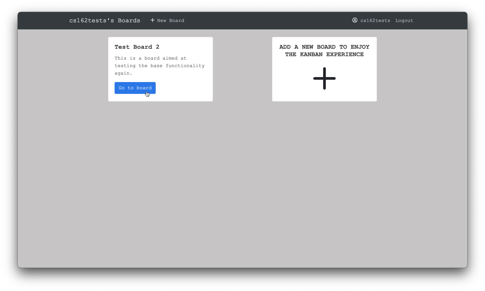

## Run Virtual Environment

Virtual environment is a key component in ensuring that the application is configured in the right environment

##### Requirements
* Python 3
* Pip 3

```bash
$ brew install python3
```

Pip3 is installed with Python3

##### Installation
To install virtualenv via pip run:
```bash
$ pip3 install virtualenv
```

##### Usage
Creation of virtualenv:

    $ virtualenv -p python3 venv

If the above code does not work, you could also do

    $ python3 -m venv venv

To activate the virtualenv:

    $ source venv/bin/activate

Or, if you are **using Windows** - [reference source:](https://stackoverflow.com/questions/8921188/issue-with-virtualenv-cannot-activate)

    $ venv\Scripts\activate

To deactivate the virtualenv (after you finished working):

    $ deactivate

Install dependencies in virtual environment:

    $ pip3 install -r requirements.txt


## Run Application

Start the server by running:

    $ export FLASK_ENV=development
    $ export FLASK_APP=web
    $ python3 app.py

## Test Users

Username: Adakole

Email: test@minerva.edu

Password: Test123

Boards: 2

---------------------
Username: cs162tests

Email: test@uni.minerva.edu

Password: Test123

Boards: 1

---------------------
Username: Samuel

Email: cs162tests@minerva.kgi.edu

Password: Test123

Boards: 1

## Demonstration Video

[](demonstration_video.mp4 "Demonstration of Kanban Board")
